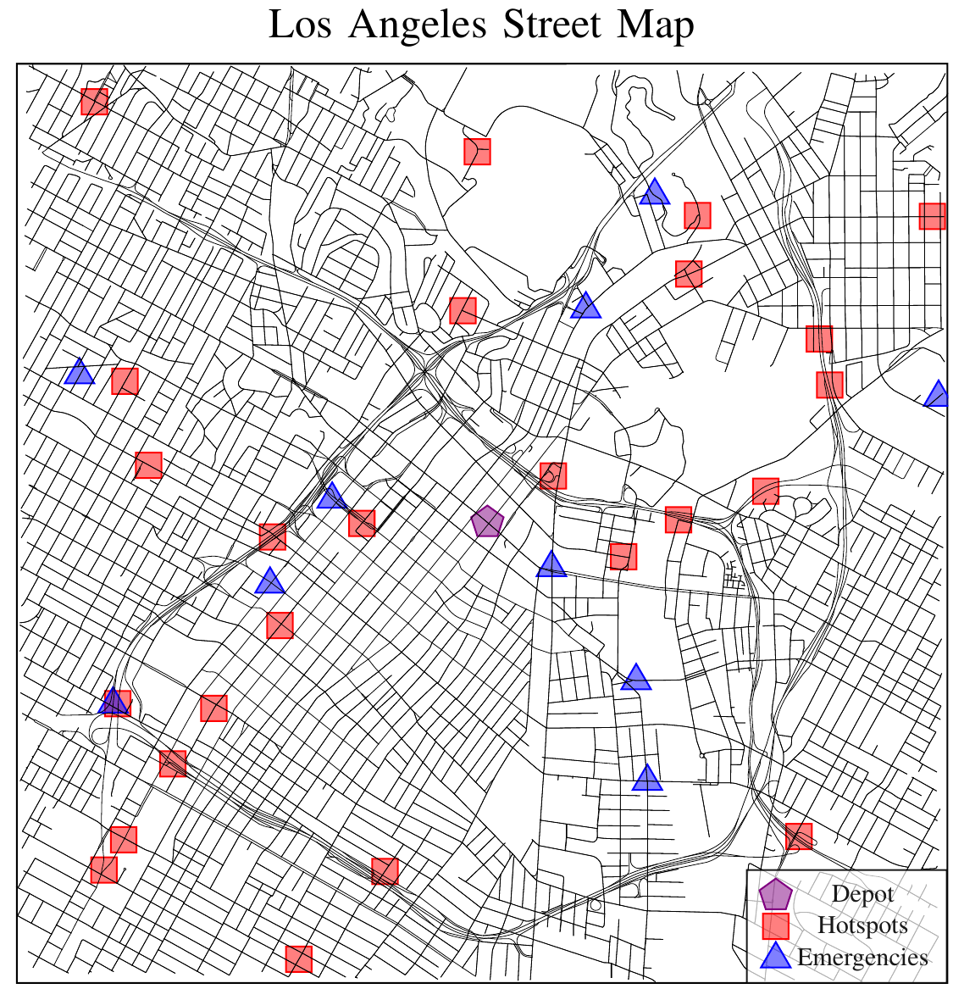
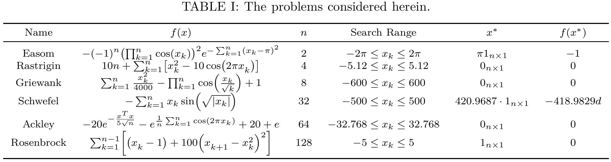
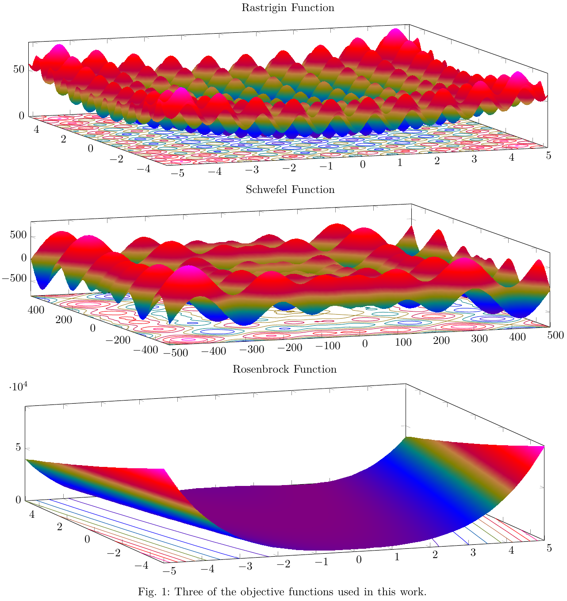

# Electric Vehicle Patrol Route Planning

This project contains code for solving the electric vehicle patrol routing problem (EVPRP).
The EVPRP involves planning paths for a fleet of electric police cars assigned to monitor "hotspots" in a given area, which are locations with an increased probability of events such as criminal activity and car accidents.
The code provided is implemented in C++ to keep running times and memory consumption to a minimum.

This project produces problems from real city layouts like the Las Angeles map shown below.
It queried from the Open Street Map project [[1](#1)] to produce real street graphs with accurate speed limits.
It also uses the battery energy consumption model described in [[2](#2)] to generate estimates of the battery consumption used over every graph edge.



The planners implemented in this repository are;

  * Genetic Algorithm [[3](#3)]
  * Evolution Strategy [[4](#4)]
  * Firefly Algorithm [[5](#5)]
  * Population-Based Simulated Annealing [[6](#6)]
  * Genetic Path Relinking Algorithm [[7](#7)]

Additionally, all of these algorithms can be hybridized by using the variable neighborhood descent [[7](#7)] algorithm as a local search procedure.
Several mutation operators, selection strategies, and population initialization methods are defined for the problem at hand.
For the planners and selection strategies, i.g., k-means selection [[8](#8)], that require a measure of distance between solutions we implement the Levenshein edit-distance [[9](#9)].

Using this package convergence plots like the ones shown below can be generated.


This repository also implements several metaheuristic algorithms for a continuously valued search space.
These implementations are used to test ideas on smaller simpler problems before implementing them for the patrol routing problem considered in the overall repository.
The algorithms implemented are;

  * Particle Swarm Optimization [[10](#10)]
  * Evolution Strategy [[11](#11)]
  * Firefly Algorithm [[12](#12)]

The smaller problems are shown in the table and figure below.






## Architecture Diagram


## Dependencies

This package is intended to be used in a [ROS 2](https://docs.ros.org/en/jazzy/index.html) Colcon workspace.
Other then Ament, which can be installed with the rest of the ROS 2 distribution you're using [here](https://docs.ros.org/en/jazzy/Installation.html), the following command will install all system dependencies on an Ubuntu system.

```bash
sudo apt install libeigen3-dev libomp-dev libjemalloc2 libjemalloc-dev libopencv-dev libblas-dev liblapack-dev libtbb-dev libboost-all-dev
pip install ray[tune] csv numpy osmnx matplotlib networkx pandas
```
Additionally, this package is dependent on another repository found here: https://github.com/james-swedeen/matplotlibcpp.

## Sub Packages

### firefly_algorithm

This package implements several metaheuristic algorithms for a continuously valued search space.
This package is used to test ideas on smaller simpler problems before implementing them for the patrol routing problem considered in the overall repository.

### graph_surveillance_planning_msgs

This package contains ROS2 message and service definitions used in the other packages.

### plan_plotter

This package contains a ROS2 node that plots surveillance plans received over a ROS2 topic.
An example result is shown below.


### street_graph

This package contains class definitions for the graph planned over in the surveillance_planner package.

### surveillance_planner

This package contains implementations of various algorithms used for solving the EVPRP, including the following:
- Cofield Accent Planner (cofield_accent_planner.hpp)
- Exhaustive Planner (exhaustive_planner.hpp)
- Firefly Planner (firefly_planner.hpp)
- Greedy Planner (greedy_planner.hpp)
- Random Planner (random_planner.hpp)
- Simulated Annealing (simulated_annealing.hpp)

## References

<a id="1">[1]</a>
OpenStreetMap contributors, “Planet dump retrieved from https://planet.osm.org ,” https://www.openstreetmap.org, 2017.

<a id="2">[2]</a>
C. Fiori, K. Ahn, and H. A. Rakha, “Power-based electric vehicle energy consumption model: Model development and validation,” Applied Energy, vol. 168, pp. 257–268, 2016. [Online]. Available: https://www.sciencedirect.com/science/article/pii/S030626191630085X

<a id="3">[3]</a>
J. H. Holland, “Adaptation in natural and artificial systems,” 1975

<a id="4">[4]</a>
H.-P. P. Schwefel, Evolution and Optimum Seeking: The Sixth Generation. USA: John Wiley & Sons, Inc., 1993.

<a id="5">[5]</a>
X.-S. Yang, “Firefly algorithms for multimodal optimization,” in Stochastic Algorithms: Foundations and Applications, O. Watanabe and T. Zeugmann, Eds. Berlin, Heidelberg: Springer Berlin Heidelberg, 2009, pp. 169–178.

<a id="6">[6]</a>
S. Kirkpatrick, C. D. Gelatt Jr, and M. P. Vecchi, “Optimization by simulated annealing,” science, vol. 220, no. 4598, pp. 671–680, 1983.

<a id="7">[7]</a>
Labadie, N., Prins, C., Prodhon, C. (2016). Metaheuristics for Vehicle Routing Problems. Germany: Wiley.

<a id="8">[8]</a>
A. Chehouri, R. Younes, J. Khoder, J. Perron, and A. Ilinca, “A selection process for genetic algorithm using clustering analysis,” Algorithms, vol. 10, no. 4, 2017. [Online]. Available: https://www.mdpi.com/1999-4893/10/4/123

<a id="9">[9]</a>
Leonid Boytsov. 2011. Indexing methods for approximate dictionary searching: Comparative analysis. ACM J. Exp. Algorithmics 16, Article 1.1 (2011), 91 pages. https://doi.org/10.1145/1963190.1963191

<a id="10">[10]</a>
J. Kennedy and R. Eberhart, “Particle swarm optimization,” in Proceedings of ICNN’95 - International Conference on Neural Networks, vol. 4, 1995, pp. 1942–1948 vol.4.

<a id="11">[11]</a>
H.-P. P. Schwefel, Evolution and Optimum Seeking: The Sixth Generation. USA: John Wiley & Sons, Inc., 1993.

<a id="12">[12]</a>
X.-S. Yang, “Firefly algorithms for multimodal optimization,” in Stochastic Algorithms: Foundations and Applications, O. Watanabe and T. Zeugmann, Eds. Berlin, Heidelberg: Springer Berlin Heidelberg, 2009, pp. 169–178.

