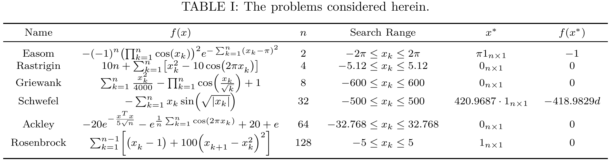
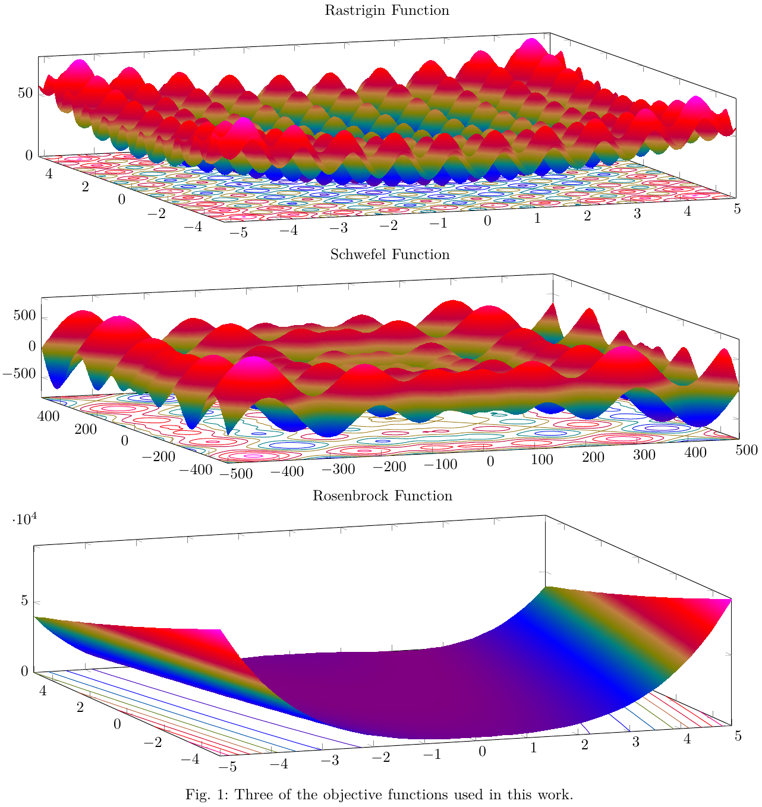
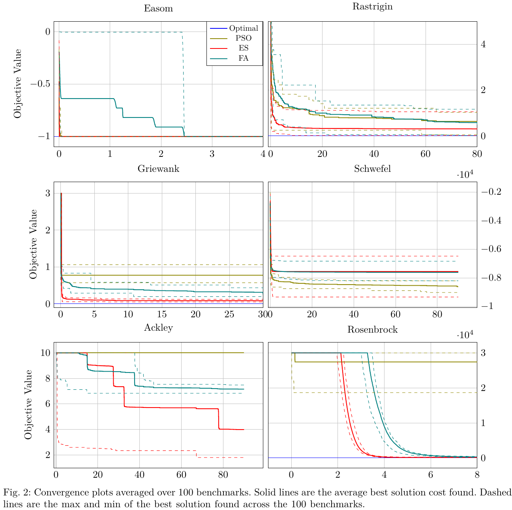

# Firefly Algorithm

This package implements several metaheuristic algorithms for a continuously valued search space.
The algorithms implemented are;

  * Particle Swarm Optimization [[1](#1)]
  * Evolution Strategy [[2](#2)]
  * Firefly Algorithm [[3](#3)]

This package is used to test ideas on smaller simpler problems before implementing them for the patrol routing problem considered in the overall repository.
These smaller problems are shown in the table and figure below.





Using this package convergence plots like the ones shown below can be generated.



## Dependencies

This package is intended to be used in a [ROS 2](https://docs.ros.org/en/jazzy/index.html) Colcon workspace.
Other then Ament, which can be installed with the rest of the ROS 2 distribution you're using [here](https://docs.ros.org/en/jazzy/Installation.html), the following command will install all system dependencies on an Ubuntu system.
```bash
sudo apt install libeigen3-dev libomp-dev libboost-all-dev libblas-dev liblapack-dev libtbb-dev
pip install ray[tune]
```
Additionally, this package is dependent on another repository found here: https://github.com/james-swedeen/matplotlibcpp.

## Usage

### Hyperparameter Tuning

The various parameters that each planner uses are tuned via [Ray Tune](https://docs.ray.io/en/latest/tune/index.html) in this package.
To do so run the following commands in separate terminals.
```bash
ros2 run firefly_algorithm firefly_tuner.py
ros2 run firefly_algorithm firefly_tuner_server
```
By default this will put the tuning result files in the `~\ray_results` directory.


### Benchmarking

To benchmark the planners run the following command.
```bash
ros2 run firefly_algorithm firefly_benchmark
```
By default this will run each of the planners saving off objective function information every generation.
Afterwards, the cost information is saved to the `~/firefly_benchmark_results` directory as CSVs with interpolated over time cost information and information given for every generation ran.

## References

<a id="1">[1]</a>
J. Kennedy and R. Eberhart, “Particle swarm optimization,” in Proceedings of ICNN’95 - International Conference on Neural Networks, vol. 4, 1995, pp. 1942–1948 vol.4.

<a id="2">[2]</a>
H.-P. P. Schwefel, Evolution and Optimum Seeking: The Sixth Generation. USA: John Wiley & Sons, Inc., 1993.

<a id="3">[3]</a>
X.-S. Yang, “Firefly algorithms for multimodal optimization,” in Stochastic Algorithms: Foundations and Applications, O. Watanabe and T. Zeugmann, Eds. Berlin, Heidelberg: Springer Berlin Heidelberg, 2009, pp. 169–178.

