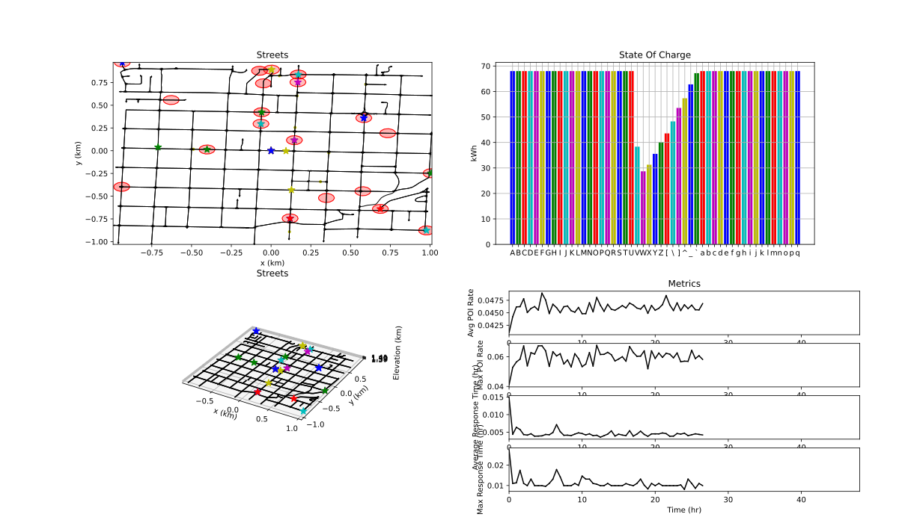

# Plan Plotter

This package contains a node for plotting a patrol routing plan with electric vehicle considerations.

## Dependencies

This package is intended to be used in a [ROS 2](https://docs.ros.org/en/jazzy/index.html) Colcon workspace.
Other then Ament, which can be installed with the rest of the ROS 2 distribution you're using [here](https://docs.ros.org/en/jazzy/Installation.html), the following command will install all system dependencies on an Ubuntu system.

```bash
pip install matplotlib
```

## Running

To start the node run the following command.
```bash
ros2 run plan_plotter plan_plotter
```
This will open a GUI where plans will be shown.
The node listens to the "/plan" topic for new plans to show.
When received it will plots the street graph and an animation of the plan along with the battery capacity of each planner over time.



### Subscriptions:

| Topic | Msg Type | Description |
| --- | --- | --- |
| /plan | PlotPlan | Contains information about the graph and plan |

