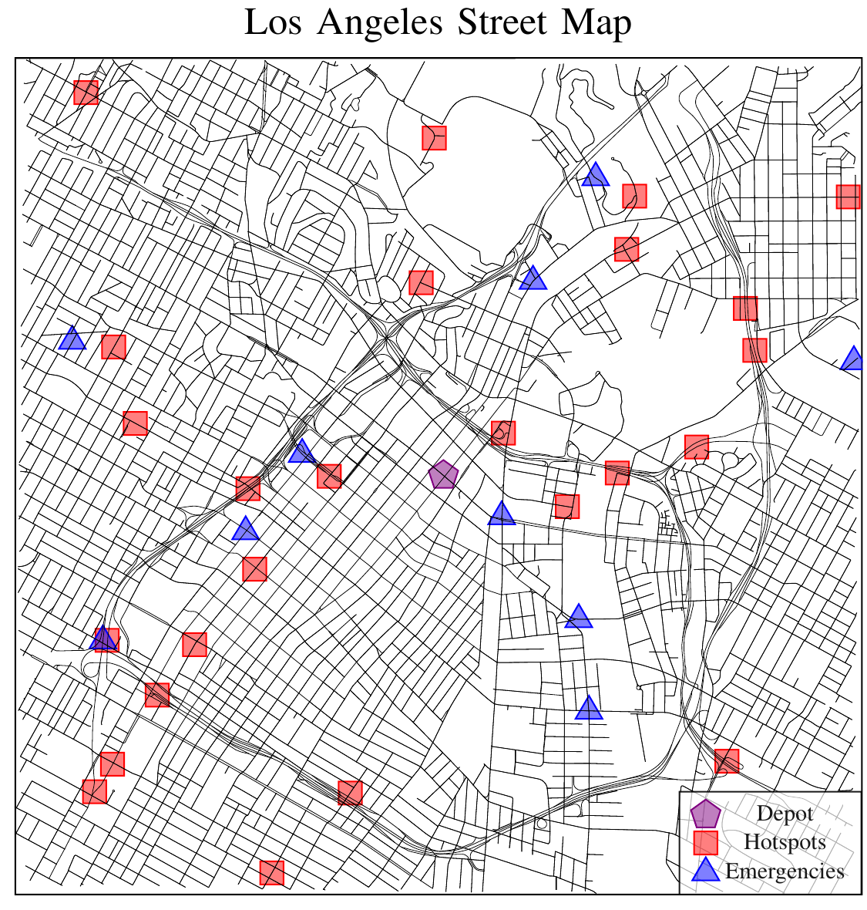

# Street Graph

This package defines the street graph that is used while planner in the `surveillance_planner` package.



## Dependencies

This package is intended to be used in a [ROS 2](https://docs.ros.org/en/jazzy/index.html) Colcon workspace.
Other then Ament, which can be installed with the rest of the ROS 2 distribution you're using [here](https://docs.ros.org/en/jazzy/Installation.html), the following command will install all system dependencies on an Ubuntu system.

```bash
sudo apt install libeigen3-dev libomp-dev libjemalloc2 libjemalloc-dev libopencv-dev libblas-dev liblapack-dev libtbb-dev
pip install osmnx matplotlib networkx pandas numpy
```
Additionally, this package is dependent on another repository found here: https://github.com/james-swedeen/matplotlibcpp.

## Generating New Configuration Files

This package comes with several configuration files in the `config/` directory.
They define the streets of a city and are fed into the `StreetGraph` class's constructor.
They are generated in the `scripts/graph_csv_gen.py` script.
The `gen_street_csvs` function in this script is called to generate new configuration files.
It queried from the Open Street Map project [[1](#1)] to produce real street graphs with accurate speed limits.
It also uses the battery energy consumption model described in [[2](#2)] to generate estimates of the battery consumption used over every graph edge.

## References

<a id="1">[1]</a>
OpenStreetMap contributors, “Planet dump retrieved from https://planet.osm.org ,” https://www.openstreetmap.org, 2017.

<a id="2">[2]</a>
C. Fiori, K. Ahn, and H. A. Rakha, “Power-based electric vehicle energy consumption model: Model development and validation,” Applied Energy, vol. 168, pp. 257–268, 2016. [Online]. Available: https://www.sciencedirect.com/science/article/pii/S030626191630085X

