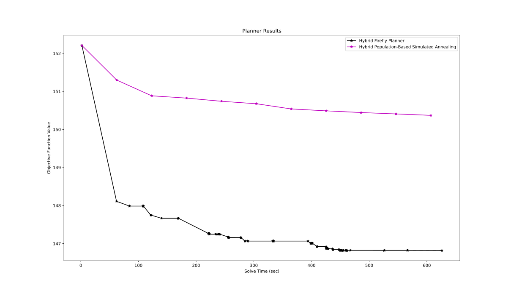
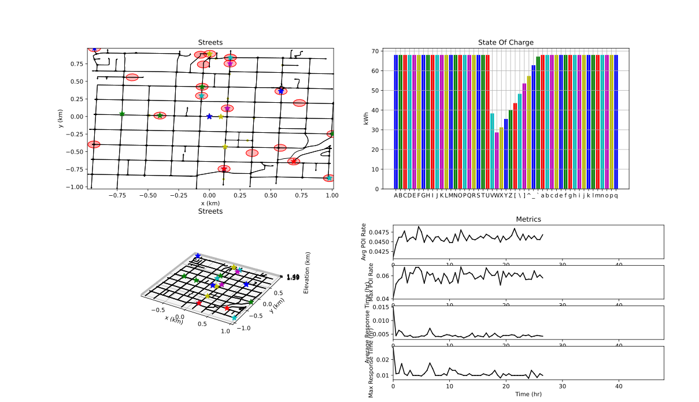

# Surveillance Planner

This package is where the metaheuristic planners for the electric vehicle patrol routing problem are implemented.
These planners are used to generate plans for patrolling officers to monitor a city while ensuring that their batteries never deplete.
The code provided is implemented to keep running times and memory consumption to a minimum.

The planners implemented in this package are;

  * Genetic Algorithm [[1](#1)]
  * Evolution Strategy [[2](#2)]
  * Firefly Algorithm [[3](#3)]
  * Population-Based Simulated Annealing [[4](#4)]
  * Genetic Path Relinking Algorithm [[5](#5)]

Additionally, all of these algorithms can be hybridized by using the variable neighborhood descent [[5](#5)] algorithm as a local search procedure.
Several mutation operators, selection strategies, and population initialization methods are defined for the problem at hand.
For the planners and selection strategies, i.g., k-means selection [[6](#6)], that require a measure of distance between solutions we implement the Levenshein edit-distance [[7](#7)].

## Dependencies

This package is intended to be used in a [ROS 2](https://docs.ros.org/en/jazzy/index.html) Colcon workspace.
Other then Ament, which can be installed with the rest of the ROS 2 distribution you're using [here](https://docs.ros.org/en/jazzy/Installation.html), the following command will install all system dependencies on an Ubuntu system.

```bash
sudo apt install libeigen3-dev libomp-dev libjemalloc2 libjemalloc-dev libopencv-dev libblas-dev liblapack-dev libtbb-dev
pip install ray[tune] csv numpy
```
Additionally, this package is dependent on another repository found here: https://github.com/james-swedeen/matplotlibcpp.

## Usage

### Planner Demonstration

This section will tell you how to run a demonstration of the planners.
First, find this section of code in `graph_surveillance_planning/surveillance_planner/src/planner_test.cpp`.

```
// Generate problem
const std::string base_dir("~/ros_ws/src/graph_surveillance_planning/street_graph/config/");
```

Edit the code to look like the following, replacing 'path-to-ws' with the path to the
ROS2 workspace used for installing the graph_surveillance_planning packages.
```
// Generate problem
const std::string base_dir("/path-to-ws/src/graph_surveillance_planning/street_graph/config/");
```

After rebuilding, you can run the planner demonstration with the following command.

```
ros2 run surveillance_planner planner_test
```

This will run the planners specified in the cpp file and plot the convergence of each planner, like the following image.



To watch the plan be simulated run the plan plotting node with the following command.

```
ros2 run plan_plotter plan_plotter
```

And then rerun the `planner_test` node.
This will produce GUI that shows the plan being executed, like the following image.



### Hyperparameter Tuning

The various parameters that each planner uses are tuned via [Ray Tune](https://docs.ray.io/en/latest/tune/index.html) in this package.
To do so run the following command.
```bash
ros2 launch surveillance_planner parameter_tuning.launch.py
```
By default this will put the tuning result files in the `~\ray_results` directory.


### Benchmarking

To benchmark the planners run the following command.
```bash
ros2 launch surveillance_planner benchmark.launch.py
```
By default this will run each of the planners saving off objective function information every generation.
Afterwards, the cost information is saved to the `~/planner_benchmark` directory as CSVs with interpolated over time cost information and information given for every generation ran.

## References

<a id="1">[1]</a>
J. H. Holland, “Adaptation in natural and artificial systems,” 1975

<a id="2">[2]</a>
H.-P. P. Schwefel, Evolution and Optimum Seeking: The Sixth Generation. USA: John Wiley & Sons, Inc., 1993.

<a id="3">[3]</a>
X.-S. Yang, “Firefly algorithms for multimodal optimization,” in Stochastic Algorithms: Foundations and Applications, O. Watanabe and T. Zeugmann, Eds. Berlin, Heidelberg: Springer Berlin Heidelberg, 2009, pp. 169–178.

<a id="4">[4]</a>
S. Kirkpatrick, C. D. Gelatt Jr, and M. P. Vecchi, “Optimization by simulated annealing,” science, vol. 220, no. 4598, pp. 671–680, 1983.

<a id="5">[5]</a>
Labadie, N., Prins, C., Prodhon, C. (2016). Metaheuristics for Vehicle Routing Problems. Germany: Wiley.

<a id="6">[6]</a>
A. Chehouri, R. Younes, J. Khoder, J. Perron, and A. Ilinca, “A selection process for genetic algorithm using clustering analysis,” Algorithms, vol. 10, no. 4, 2017. [Online]. Available: https://www.mdpi.com/1999-4893/10/4/123

<a id="7">[7]</a>
Leonid Boytsov. 2011. Indexing methods for approximate dictionary searching: Comparative analysis. ACM J. Exp. Algorithmics 16, Article 1.1 (2011), 91 pages. https://doi.org/10.1145/1963190.1963191

